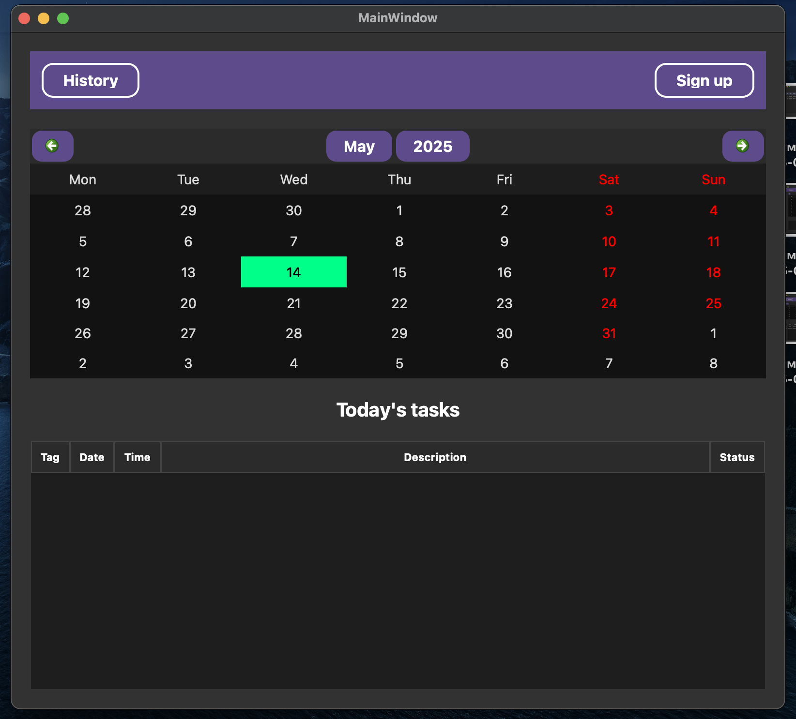
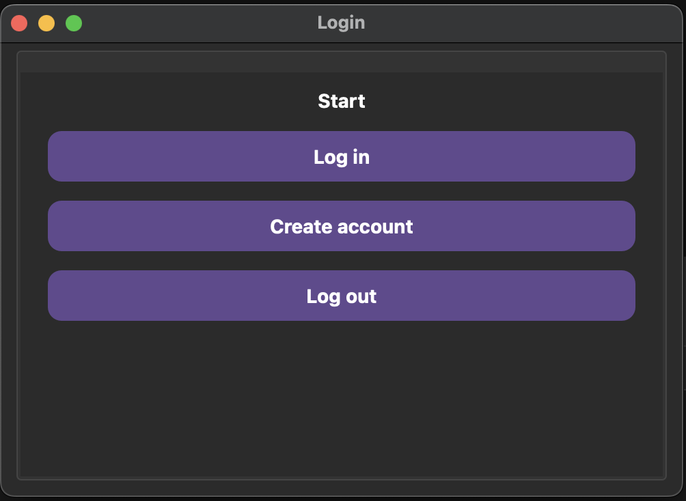
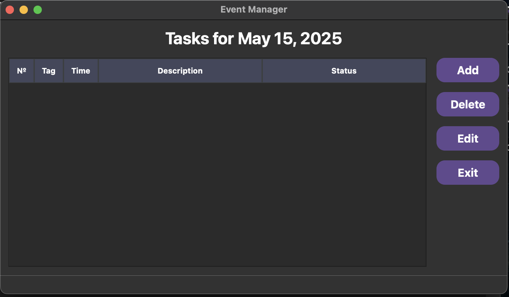
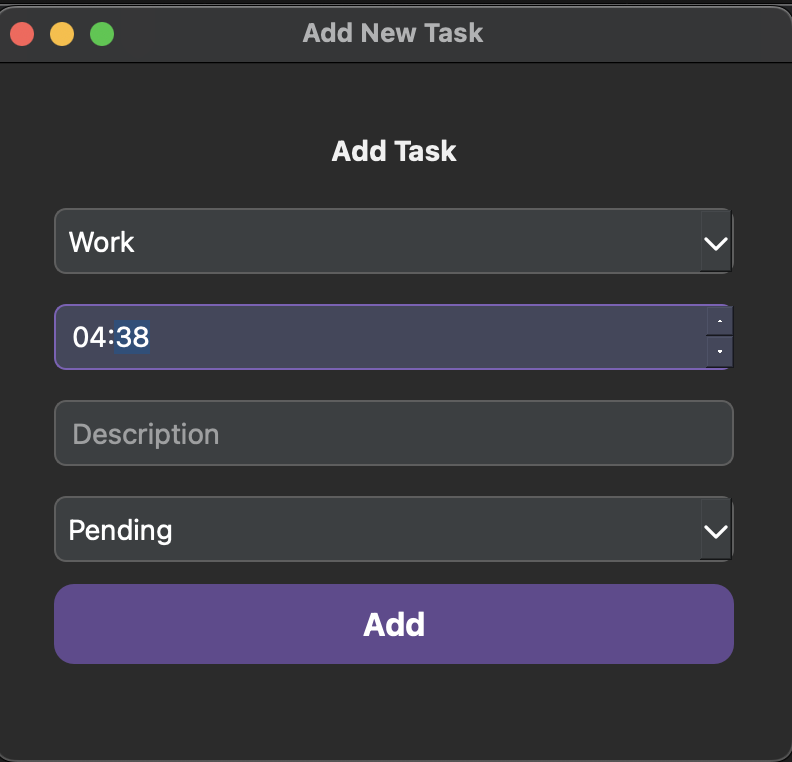
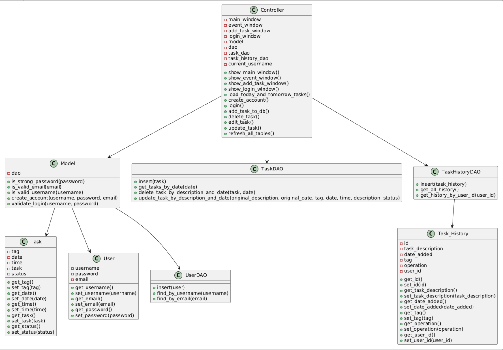

# 📝 Task Manager

Task Manager is a comprehensive project management application designed to help teams track and organize tasks efficiently. Built with Python and featuring an intuitive graphical user interface, this application allows users to create, assign, and monitor tasks throughout their lifecycle. With robust database integration, Task Manager provides real-time updates and persistent storage for all team workflows.

## ✨ Key Functionalities

1) **User Authentication System** - Secure login and registration functionality with password validation.
2) **Task Creation and Management** - Ability to create, edit, and delete tasks with descriptions, dates, and times.
3) **Task Categorization** - Organization of tasks using customizable tags (work, personal, study, etc.).
4) **Status Tracking** - Monitor task progress with status options (complete, pending).
5) **Calendar Integration** - Interactive calendar for selecting dates and viewing scheduled tasks.
6) **Daily Tasks Overview** - Dedicated view displaying today's pending tasks for immediate focus.
7) **Task History Logging** - Comprehensive tracking of all task operations (additions, edits, deletions) with timestamps.
8) **Multi-window Interface** - Separate windows for task management, event details, and task editing.
9) **Real-time Database Synchronization** - Instant updates across the application when changes are made.
10) **Dark Mode UI** - Modern, eye-friendly dark interface with consistent styling throughout the application.

## 👥 Our Team
- [Madina](https://github.com/nurlanovva) (nurlanovva): 🧠 Code and logic.
- [Nazik](https://github.com/abdrhmnva) (abdrhmnva): 🎨🗄️ Design, GUI and Databases. 

## 📂 Structure
- [user.py](classes/user.py) : Contains the class that creates `User` instances.
- [task.py](classes/task.py) : Contains the class that creates `Task` instances.
- [task_history](classes/task_history.py) : Class that creates `Task_History` instances.
- [BaseDao](dao/base_dao.py) : The foundation class that provides common database operations (CRUD). All other DAOs inherit from this class to leverage its connection management and basic query functionality.
- [task_dao](dao/task_dao.py) : Handles persistence and retrieval of tasks in the system. This DAO manages operations like creating new tasks, updating task status, retrieving task lists by various criteria, and task deletion.
- [task_history_dao](dao/task_history_dao.py) : Manages the historical record of task changes. This DAO tracks modifications to tasks including status changes, assignment updates, and other important events to maintain an audit trail.
- [user_dao](dao/user_dao.py) : Responsible for user-related database operations such as user authentication, profile management, and user permissions. This DAO handles creating user accounts, updating user information, and validating credentials.
- [event.py](pyqt/event.py) - Class that displays event window.
- [history.py](pyqt/history.py) - Class that displays history window.
- [logintask.py](pyqt/logintask.py) - Class that displays login window.
- [task_input.py](pyqt/task_input.py) - Class that takes input from user and adds a new task.
- [task.py](pyqt/task.py) -  Class that displays task window.
- [controller.py](controller.py) : This file makes the connection between logic and design.
- [main.py](main.py) : File that launches the whole program.
- [model.py](model.py) : File that contains the logic of program.

## 📸 Screenshots

### Main Window


### Login Window


### Tasks for a day


### Add new Task Window



## Classes

### 🗂️ Task Class
The `Task` class is a container that holds information about a single task. It stores five main pieces: the tag (category), date, time, description, and status of the task. The class keeps this data private (using __) and provides simple methods to get or change each piece of information. When printed, it shows a summary of the task's details in a readable format.

#### Attributes 
- `tag`: Task's tag.
- `date`: Date when the task must be done.
- `time`: Time when the task must be done.
- `task`: Task's point.
- `status`: Task's status(pending/completed).

### 📝 Task_History Class
The `Task_History` class keeps track of changes made to tasks. It records what task was changed, when it happened, what kind of change occurred (added, edited, or deleted), and who made the change. It provides simple ways to access or update this information through get and set methods. This helps the app maintain a complete history of all task activities.

#### Attributes 
- `id`: History's id.
- `task_description`: Description of task.
- `date_added`: The date when the task was added to history.
- `tag`: Tag of task.
- `operation`: The operation applied to task.
- `user_id`: ID of user that added task.

### 👤 User Class
The User class stores basic account information (username, password, email) with private attributes. It provides getter methods to access this information and setter methods to update it when needed. This class follows encapsulation principles by controlling how user data is accessed and modified throughout the application.

#### Attributes 
- `username`: User's username.
- `password`: User's password.
- `email`: User's email address.

### 🗄️ BaseDao class
This class represents a blueprint for managing user-related database operation classes.

#### Attributes
- `db_path`:  path do database.

#### Methods
- `execute_query(query: str, params=None)`: Executes the SQL query that is given in `query` attribute with some parameters which are `None` by default.
- `fetch_all(query: str, params=None)`: Return all records contained in cursor.
- `fetch_one(query: str, params=None)`: Return one record contained in cursor.

### 🗄️ TaskDAO class
This class provides functionality to interact with the tasks table in the database. 
The class includes methods to insert new tasks, retrieve task details by date or description, fetch all tasks, and update them. Inherits from `BaseDao.py`.

#### Attributes
- `db_path`: path do database.

#### Methods
- `insert(task: Task)`: Inserts new `Task` object into Users table.
- `get_tasks_by_date(self, date)`: Finds the record in database with the given `date`.
- `update_task_by_description_and_date(self, original_description, original_date, tag, date, time, description, status)`: Updates the task.
- `delete_task_by_description_and_date(self, task, date)`: Deletes task with given `description` and `date`.

### 🗄️ TaskHistoryDAO class
The TaskHistoryDAO class connects the app to the database for storing and retrieving task history records. It has three simple jobs:

1) Save new history entries when tasks are added, edited, or deleted
2) Get all history records from the database
3) Find history records for a specific user

It works like a translator between the app's memory and the permanent storage, making sure all task changes are properly recorded and can be viewed later.

#### Attributes
- `db_path`: path do database.

#### Methods
- `insert(self, task_history)`: Adds task to the history.
- `get_all_history(self)`: Returns all records in table.
- `get_history_by_user_id(self, user_id)`: Finds history based on `user_id`.

### 👤 UserDAO class
This class acts as a bridge between the application and the user data stored in the database, providing simple methods to save new users and look up existing ones.

#### Attributes
- `db_path`: path do database.

#### Methods
- `insert(self, user: User)`:  Adds a new user to the database with username, password, and email.
- `find_by_username(self, username: str)`:  Searches and returns a user by username.
- `find_by_email(self, email: str)`: Searches and returns a user by email address.

### 🧠 Model class
The Model class handles user accounts and security for the Task Manager application. It connects to the user database and provides several validation features. The class checks password strength by ensuring passwords have at least 8 characters and contain uppercase letters, lowercase letters, numbers, and special symbols. It also validates email addresses and usernames to make sure they follow proper formats. When creating new accounts, the Model checks that all information is complete and valid, confirming usernames and emails don't already exist in the system. For login attempts, it verifies the username exists and the password matches what's stored in the database. Overall, this class acts as the security gatekeeper, making sure only valid users with secure passwords can access the system.

#### Methods
- `is_strong_password(self, password`: Checks if a password is secure by making sure it has at least 8 characters, uppercase letters, lowercase letters, numbers, and special symbols.
- `is_valid_email(self, email)`: Checks if an email address looks correct (has username, @ symbol, and domain).
- `is_valid_username(self, username)`: Makes sure username only contains English letters, numbers, or underscores.
- `create_account(self, username, password, email)`: Creates a new user after checking all fields are filled in, username and email formats are correct, password is strong, and username/email don't already exist.
- `validate_login(self, username, password)`: Checks if login information is correct by making sure fields aren't empty, the username exists, and the password matches.

### 🔗 Controller class
#### Methods
- `show_main_window(self)`: Displays main window with task list and "TO DO TODAY" label.
- `show_event_window(self)`: Displays window for tasks on a specific date.
- `show_add_task_window(self)`: Shows form for adding new tasks.
- `show_login_window(self)`: Opens login screen for user authentication..
- `init_main_window_buttons(self)`: Sets up main window button functionality.
- `init_event_window_buttons(self)`: Links event window buttons to their actions.
- `init_login_window_buttons(self)`: Connects login window buttons to their functions.
- `logout(self)`: Ends user session and returns to login screen.
- `load_today_and_tomorrow_tasks(self)`: Displays current day's tasks in main window.
- `clear_login_window(self)`: Resets all login form fields.
- `create_account(self)`: Registers new users after validation.
- `login(self)`: Authenticates users and opens main application.
- `add_task_to_db(self)`: Saves new tasks to database.
- `delete_task(self)`: Removes selected tasks from system.
- `edit_task(self)`: Opens form with task details for editing.
- `update_task(self, row, original_date, original_description)`: Saves changes to edited tasks.
- `add_task(self)`: Shows task creation form.
- `on_date_clicked(self)`: Opens task view for selected calendar date.
- `print_task_for_a_day(self, selected_date)`: Shows all tasks for specific date.
- `refresh_all_tables(self)`: Updates all task displays after changes.
- `log_task_history(self, task_description, tag, operation)`: Records all task operations in history.
- `show_task_history(self)`: Displays log of all task activities.

## 🖼️ UML Diagram


## ⚙️ Installation and Usage
1. Clone the repository:
    ```bash
    git clone https://github.com/abdrhmnva/task-manager
    ```
2. Navigate to the project directory:
    ```bash
    cd task-manager
    ```
    
3. Run the script:
    ```bash
    python main.py
    ```